# SecureSend — Complete Project Documentation

This single document merges all four project READMEs into one place:

1. **System Architecture** — how the frontend and two backends fit together
2. **Node.js Backend** (`backend-node/`) — Express + MongoDB API
3. **Java Backend** (`backend-java/`) — Spring Boot + MongoDB API (same contract as Node)
4. **Frontend** (`frontend/`) — React + TanStack Start app

---

## 📑 Table of Contents

- [Part 1 — System Architecture](#part-1--system-architecture)
- [Part 2 — Node.js Backend](#part-2--nodejs-backend)
- [Part 3 — Java Backend](#part-3--java-backend)
- [Part 4 — Frontend](#part-4--frontend)

---

# Part 1 — System Architecture

## SecureSend — System Architecture Overview

SecureSend is a zero-knowledge, end-to-end encrypted messaging platform with a dual-implementation backend and a single shared frontend. This document ties together the three project folders:

- **`frontend/`** — React 19 + TanStack Start SPA (see the **Frontend** section)
- **`backend-node/`** — Express + MongoDB API (see the **Node.js Backend** section)
- **`backend-java/`** — Spring Boot + MongoDB API, functional twin of `backend-node` (see the **Java Backend** section)

Both backends implement the **exact same API contract** and read/write the **same MongoDB schema**, so the frontend can point at either one with just an environment variable change.

---

### 1. High-Level System Diagram

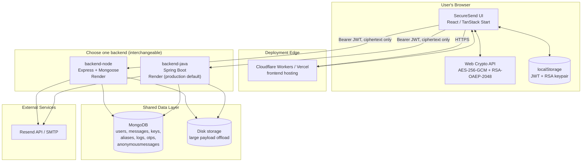

---

### 2. Why Two Backends?

`backend-java` is a Spring Boot re-implementation of `backend-node`, built to the identical route/response contract. This lets the team:

- Compare performance/operational characteristics of Node vs. JVM for the same workload.
- Migrate production traffic without a data migration (both share one MongoDB database).
- Fail over from one to the other if needed — the frontend's `lib/api.ts` only needs a `VITE_API_URL` change.

| | backend-node | backend-java |
|---|---|---|
| Language | JavaScript (Node.js) | Java 21 |
| Framework | Express 4 | Spring Boot 3.3 |
| ORM/ODM | Mongoose | Spring Data MongoDB |
| Auth | JWT (`jsonwebtoken`) + bcryptjs | JWT (`jjwt`) + Spring Security `BCryptPasswordEncoder` |
| Rate limiting | `express-rate-limit`, per-route | Not yet ported |
| Current production role | Available / dev default | Default production target (`clarity-connect-1.onrender.com`) |

---

### 3. Zero-Knowledge Encryption Model

The single most important architectural property of SecureSend: **the server never has access to plaintext or private keys.**

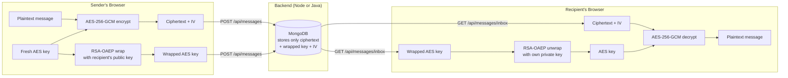

Private RSA keys are generated by the browser's Web Crypto API and stored **only** in that browser's `localStorage` — they are never transmitted to either backend.

---

### 4. Shared Data Model Summary

Both backends operate on the same seven MongoDB collections:

| Collection | Purpose | Notable indexing |
|---|---|---|
| `users` | Accounts (email, bcrypt hash, public key) | unique `email` |
| `otps` | Signup / password-reset one-time codes | TTL, 10-minute expiry |
| `aliases` | Disposable `*@securesend.co.in` email aliases | TTL, 24-hour expiry; compound `{realEmail, isActive}` |
| `messages` | E2E-encrypted message envelopes | index on `expiresAt` |
| `keys` | RSA public keys per user | unique `userId` |
| `logs` | Per-message view/decrypt/delete audit trail | index on `messageId` |
| `anonymousmessages` | Anonymous email thread records | index on `to` |

See each backend's README for full field-level schemas (the **Node.js Backend** section §4, the **Java Backend** section §4) — they're identical.

---

### 5. Request Lifecycle (Either Backend)

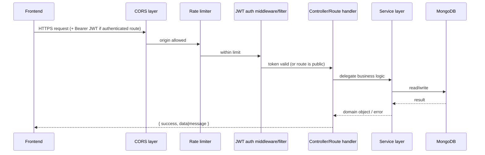

---

### 6. Deployment Topology (as configured in the repo)

| Component | Platform(s) referenced in CORS / config |
|---|---|
| Frontend | Cloudflare Workers (`wrangler.jsonc`), Vercel (`*.vercel.app`), Cloudflare Pages (`*.pages.dev`) |
| backend-node | Render (`clarity-connect.onrender.com`), local `:5000` |
| backend-java | Render (`clarity-connect-1.onrender.com`, `*.onrender.com`), local `:5000` |
| Database | MongoDB (Atlas or self-hosted — connection via `MONGODB_URI`) |
| Email | Resend API (primary), SMTP (fallback) |

Custom domains referenced: `securesend.co.in`, `www.securesend.co.in`, `message.securesend.co.in`, `www.message.securesend.co.in`.

---

### 7. Where to Go Next

- **API details** (every endpoint, request/response body): top-level [`README.md`](#-api-reference-full-endpoint-details), or the equivalent section in the **Node.js Backend** section / the **Java Backend** section.
- **Frontend routes and components**: the **Frontend** section.
- **Encryption internals**: `frontend/src/components/securesend/crypto.ts`, documented in the **Frontend** section §7.


---

# Part 2 — Node.js Backend

## SecureSend — Node.js Backend

Express + MongoDB implementation of the SecureSend API. This is one of two interchangeable backend implementations in this repository (the other is `backend-java`, a Spring Boot port of the same API contract). Either one can serve the `frontend` app unmodified, since both expose the same routes, request/response shapes, and MongoDB collections.

> SecureSend lets users exchange end-to-end encrypted text/image/voice/file messages, send anonymous emails through disposable aliases, and manage public keys for hybrid (RSA + AES) encryption. The server **never sees plaintext** — all encryption/decryption happens in the browser (see `frontend/src/components/securesend/crypto.ts`).

---

### 1. Tech Stack

| Layer | Technology |
|---|---|
| Runtime | Node.js (CommonJS) |
| Web framework | Express 4 |
| Database | MongoDB (via Mongoose 8) |
| Auth | JWT (`jsonwebtoken`), bcrypt password hashing (`bcryptjs`, 12 rounds) |
| Email | `resend` (primary) / `nodemailer` (SMTP fallback) |
| Rate limiting | `express-rate-limit` |
| Dev tooling | `nodemon` |

---

### 2. Project Structure

```
backend-node/
├── src/
│   ├── server.js              # Entry point — connects Mongo, starts cron, starts HTTP server
│   ├── app.js                 # Express app: CORS, body parsing, route mounting, error handler
│   ├── config/
│   │   ├── db.js              # Mongoose connection helper
│   │   └── env.js             # Environment variable loader
│   ├── models/                # Mongoose schemas (see §4 Data Model)
│   ├── controllers/           # Route handler logic per resource
│   ├── services/               # Business logic (aliasing, mail, cleanup, key mgmt, payload storage)
│   ├── middleware/
│   │   ├── auth.middleware.js # JWT verification, attaches req.user
│   │   ├── rateLimiter.js     # Named limiters (see §6)
│   │   └── error.middleware.js
│   ├── routes/                # Express routers, one per resource
│   └── utils/
│       ├── logger.js
│       └── payloadStorage.js  # Offloads large message payloads (> MAX_INLINE_MESSAGE_BYTES) to disk
├── package.json
└── ALIAS_SYSTEM_GUIDE.js      # Design notes for the disposable-alias subsystem
```

---

### 3. Architecture

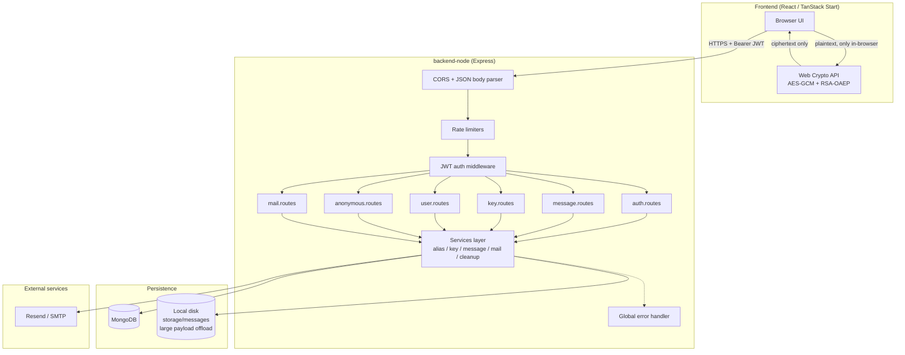

**Key design decisions**

- **Zero-knowledge server**: the API only ever stores/forwards ciphertext (`encryptedData`, `encryptedAESKey`, `iv`, `salt`). Plaintext and private keys never leave the browser.
- **Hybrid encryption**: a fresh AES-256-GCM key encrypts the message body; that AES key is wrapped with the recipient's RSA-OAEP-2048 public key so only the recipient can unwrap it.
- **Stateless auth**: JWT bearer tokens (7-day expiry), no server-side sessions — horizontally scalable.
- **TTL-based expiry**: MongoDB TTL indexes auto-delete expired OTPs (`otp.model.js`, 10 min) and aliases (`alias.model.js`, on `expiresAt`); messages are lazily wiped of their encrypted payload when read past `expiresAt`, and a monthly cron (`cleanup.service.js`) purges them outright.
- **Large payload offload**: message payloads over `MAX_INLINE_MESSAGE_BYTES` (default 12 MB, e.g. voice/file attachments) are written to disk via `payloadStorage.js` instead of inflating MongoDB documents.

---

### 4. Data Model (MongoDB Collections)

#### `users`
| Field | Type | Notes |
|---|---|---|
| `_id` | ObjectId | |
| `email` | String | unique, lowercase, trimmed |
| `passwordHash` | String | bcrypt (12 rounds), hashed via pre-save hook |
| `publicKey` | String \| null | RSA public key (also mirrored in `keys` collection) |
| `createdAt` / `updatedAt` | Date | timestamps |

#### `otps`
| Field | Type | Notes |
|---|---|---|
| `email` | String | |
| `otp` | String | 6-digit code |
| `createdAt` | Date | **TTL index — document auto-deletes after 600s** |

#### `aliases`
| Field | Type | Notes |
|---|---|---|
| `alias` | String | unique, format `name123@securesend.co.in` |
| `realEmail` | String | owner's real email, indexed |
| `isActive` | Boolean | default `true`, indexed |
| `expiresAt` | Date | **TTL index (`expireAfterSeconds: 0`)** — 24h lifetime |
| `createdAt` | Date | |

Compound index: `{ realEmail: 1, isActive: 1 }` for fast "does this user already have an active alias" lookups.

#### `messages`
| Field | Type | Notes |
|---|---|---|
| `encryptedData` | String | AES-GCM ciphertext (base64) |
| `encryptedAESKey` | String | RSA-wrapped AES key (base64) |
| `iv` | String | AES-GCM IV (base64) |
| `salt` | String \| null | PBKDF2 salt (symmetric/password mode) |
| `keyIv` | String \| null | |
| `encryptionMode` | Enum | `HYBRID` \| `SYMMETRIC` |
| `kdf`, `kdfIterations` | String / Number | key-derivation metadata |
| `aesAlgorithm`, `rsaAlgorithm` | String | |
| `senderId` / `receiverId` | ObjectId → `users` | |
| `type` | Enum | `text` \| `image` \| `voice` \| `file` |
| `protection` | Enum | `quick` \| `password` \| `key` \| `hybrid` |
| `password` | String \| null | optional passphrase gate |
| `fileUrl` | String \| null | pointer to offloaded payload on disk |
| `isAnonymous` | Boolean | |
| `viewOnce` | Boolean | payload wiped after first genuine view |
| `expiresAt` | Date \| null | indexed |
| `views` | Number | |
| `logs[]` | Array | `{ viewedAt, ip, device, userId }` per view |
| `createdAt` / `updatedAt` | Date | |

#### `keys`
| Field | Type | Notes |
|---|---|---|
| `userId` | ObjectId → `users` | unique — one primary key per user |
| `publicKey` | String | |

#### `logs`
| Field | Type | Notes |
|---|---|---|
| `messageId` | ObjectId → `messages` | indexed |
| `userId` | ObjectId → `users` \| null | |
| `event` | Enum | `created` \| `viewed` \| `decrypted` \| `deleted` \| `failed_attempt` |
| `ipAddress`, `device` | String | |
| `status` | Enum | `success` \| `failed` |
| `details` | String \| null | |

#### `anonymousmessages`
| Field | Type | Notes |
|---|---|---|
| `to` | String | recipient email or alias, indexed |
| `subject`, `message` | String | |
| `senderAlias` | String | |
| `unread` | Boolean | default `true` |
| `createdAt` / `updatedAt` | Date | |

#### Entity Relationships

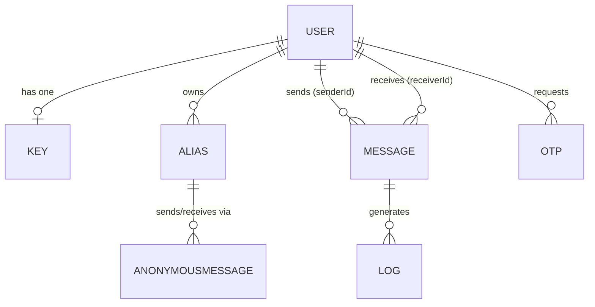

---

### 5. API Reference

Base path: `/api` (mail routes are mounted at the root — see below). Full endpoint-by-endpoint documentation, including request/response bodies, lives in the top-level [`README.md`](#-api-reference-full-endpoint-details) of this repository. Summary:

| Resource | Base Path | Auth | Description |
|---|---|---|---|
| Auth | `/api/auth` | Mixed | OTP signup, login, password reset, `GET /me` |
| Messages | `/api/messages` | Mixed | Send/read/delete encrypted messages, public share links |
| Keys | `/api/keys` | Required | Register/fetch/delete RSA public keys |
| Users | `/api/users` | Required | Search users by email for recipient selection |
| Anonymous | `/api/anonymous` | Mixed | Disposable alias + anonymous email inbox/outbox |
| Mail | `/` (root, no `/api` prefix) | Required | Generic transactional email send |

#### Standard response envelope

```json
// success
{ "success": true, "data": { }, "message": "optional" }

// error
{ "success": false, "message": "Description of what went wrong" }
```

#### Route table

| Method | Path | Auth | Rate Limiter |
|---|---|---|---|
| POST | `/api/auth/request-otp` | Public | `authLimiter` |
| POST | `/api/auth/verify-otp` | Public | `authLimiter` |
| POST | `/api/auth/signup` | Public | `authLimiter` |
| POST | `/api/auth/login` | Public | `authLimiter` |
| POST | `/api/auth/forgot-password` | Public | `authLimiter` |
| POST | `/api/auth/reset-password` | Public | `authLimiter` |
| GET | `/api/auth/me` | Required | `generalApiLimiter` |
| POST | `/api/messages` | Required | `messageLimiter` |
| GET | `/api/messages/inbox` | Required | `generalApiLimiter` |
| GET | `/api/messages/outbox` | Required | `generalApiLimiter` |
| GET | `/api/messages/:id` | Public (share link) | `publicMessageLimiter` |
| POST | `/api/messages/:id/view` | Public (share link) | `publicMessageLimiter` |
| DELETE | `/api/messages/expired` | Required | `generalApiLimiter` |
| DELETE | `/api/messages/:id` | Required (sender/receiver only) | `generalApiLimiter` |
| POST | `/api/keys/register` | Required | `generalApiLimiter` |
| GET | `/api/keys/:userId` | Required | `generalApiLimiter` |
| GET | `/api/keys/me/current` | Required | `generalApiLimiter` |
| DELETE | `/api/keys/clear` | Required | `generalApiLimiter` |
| GET | `/api/users/search?q=&protection=` | Required | global |
| POST | `/api/anonymous/send` | Public | `sendAnonymousEmailLimiter` |
| POST | `/api/anonymous/generate-alias` | Required | `generalApiLimiter` |
| GET | `/api/anonymous/inbox` | Required | `generalApiLimiter` |
| POST | `/api/anonymous/mark-read/:id` | Required | `generalApiLimiter` |
| POST | `/send-email` | Required | — |

### 6. Rate Limiting

| Limiter | Window | Max Requests | Applied To |
|---|---|---|---|
| `authLimiter` | 15 min | 5 | OTP, login, signup, password reset |
| `messageLimiter` | 1 min | 20 | Sending a secure message |
| `generalApiLimiter` | 1 min | 60 | Most authenticated GET/DELETE endpoints |
| `sendAnonymousEmailLimiter` | 1 min | 10 | Sending an anonymous email |
| `publicMessageLimiter` | 1 min | 5 | Public message read/view-tracking |

Exceeding a limit returns `429` with `{ "success": false, "status": 429, "error": "Too Many Requests", "message": "..." }`.

---

### 7. End-to-End Flows

#### 7.1 Signup / Login

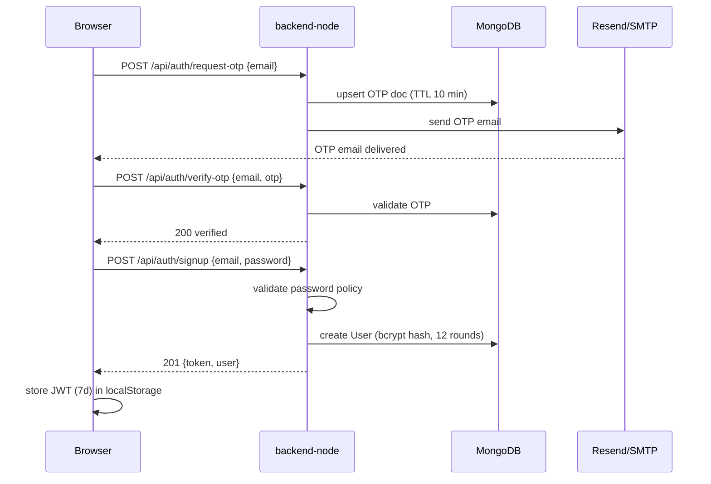

#### 7.2 Sending an End-to-End Encrypted Message (Hybrid)

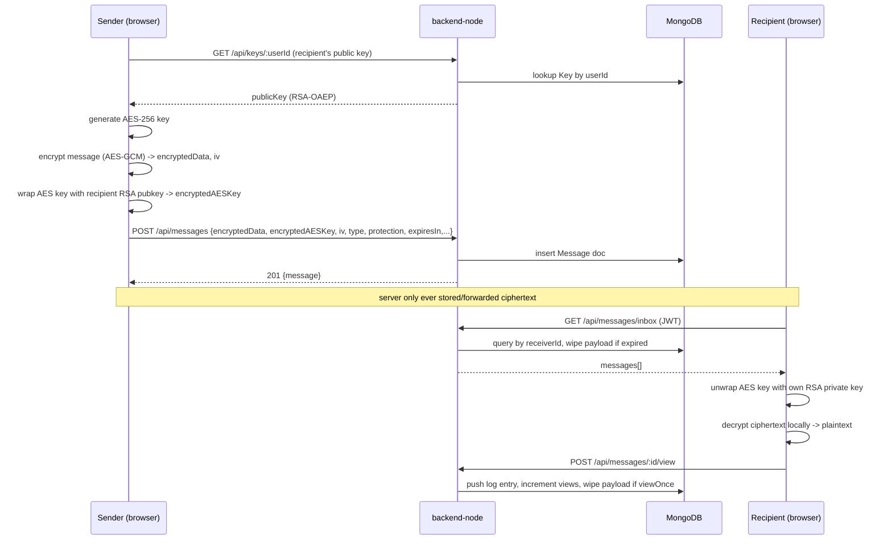

#### 7.3 Anonymous Email via Disposable Alias

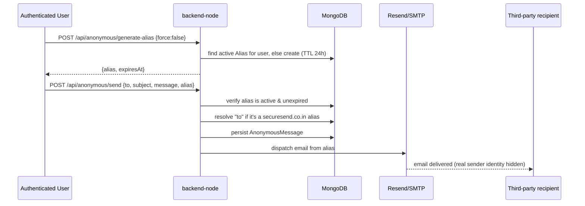

#### 7.4 Message Expiry & Cleanup

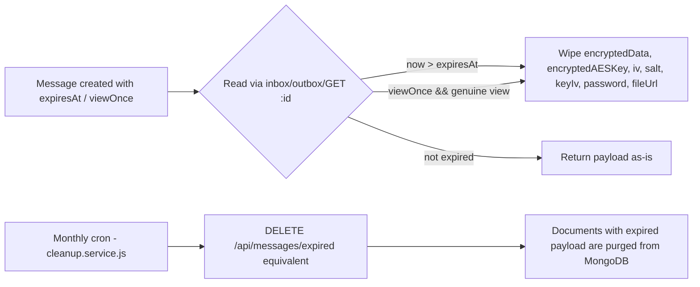

---

### 8. Environment Variables

| Variable | Default | Description |
|---|---|---|
| `PORT` | `5000` | HTTP port |
| `MONGODB_URI` | `mongodb://127.0.0.1:27017/securesend` | Mongo connection string |
| `NODE_ENV` | `development` | `production` disables verbose error bodies |
| `JWT_SECRET` | — | HS256 signing secret, required in production |
| `REQUEST_LIMIT_MB` | `12` | Max JSON/urlencoded body size |
| `RESEND_API_KEY` | — | Resend transactional email API key |
| `SMTP_HOST` / `SMTP_PORT` / `SMTP_USER` / `SMTP_PASS` | — | Fallback SMTP credentials |
| `MAX_INLINE_MESSAGE_BYTES` | `12582912` (12 MB) | Threshold above which payloads are offloaded to disk |

Create a `.env` file at `backend-node/.env` with these values before running locally.

---

### 9. Running Locally

```bash
cd backend-node
npm install

# create .env with at least MONGODB_URI and JWT_SECRET
npm run dev      # nodemon, auto-restart
# or
npm start        # plain node
```

The server connects to MongoDB, starts the monthly cleanup cron (`startMonthlyCleanupCron`), then listens on `PORT` (default `5000`). All routes are prefixed with `/api` except `mail.routes.js`, which is mounted at the application root.

#### CORS

Allowed origins are hard-coded in `app.js`: `localhost` (any port), `127.0.0.1` (any port), the production domains (`securesend.co.in` and subdomains), plus any `*.vercel.app`, `*.pages.dev`, or `*.workers.dev` preview subdomain.

---

### 10. Error Handling

All errors funnel through the global error middleware in `app.js`, which normalizes common cases:

| Condition | Status |
|---|---|
| Payload too large | `413` |
| Malformed JSON body | `400` |
| Mongoose `ValidationError` | `400` |
| Mongoose `CastError` (bad ObjectId) | `400` |
| Duplicate key (`E11000`) | `409` |
| Unhandled | `500` (or `err.status`) |

In non-production environments, the response also includes `error` (raw message) and `details` (debug payload) fields.


---

# Part 3 — Java Backend

## SecureSend — Java (Spring Boot) Backend

Spring Boot 3.3 / Java 21 implementation of the SecureSend API. This is a **1:1 functional port** of `backend-node` (Express + Mongoose) onto Spring Boot + Spring Data MongoDB — same routes, same MongoDB collections/shape, same JWT contract, same response envelope. Either backend can serve the `frontend` app interchangeably; the production deployment (`clarity-connect-1.onrender.com`) currently runs this Java backend.

> SecureSend lets users exchange end-to-end encrypted text/image/voice/file messages, send anonymous emails through disposable aliases, and manage public keys for hybrid (RSA + AES) encryption. The server **never sees plaintext** — all encryption/decryption happens in the browser (see `frontend/src/components/securesend/crypto.ts`).

---

### 1. Tech Stack

| Layer | Technology |
|---|---|
| Language / runtime | Java 21 |
| Framework | Spring Boot 3.3.2 |
| Web | Spring Web (MVC, servlet stack) |
| Database | MongoDB via Spring Data MongoDB |
| Security | Spring Security (stateless, custom JWT filter) |
| JWT | `jjwt` 0.12.6 (api/impl/jackson) |
| Password hashing | `BCryptPasswordEncoder` (12 rounds) |
| Email | Spring Mail (SMTP) + Resend HTTP API |
| Build | Maven (`pom.xml`), Java 21 toolchain |
| Container | Multi-stage Docker build → `eclipse-temurin:21-jre-alpine` |

---

### 2. Project Structure

```
backend-java/
├── src/main/java/com/securesend/
│   ├── SecuresendApplication.java     # @SpringBootApplication entry point
│   ├── config/
│   │   ├── SecurityConfig.java        # Filter chain, permitAll routes, stateless sessions
│   │   └── CorsConfig.java            # CORS allow-list (see §9)
│   ├── security/
│   │   ├── JwtTokenProvider.java      # Sign/verify HS256 tokens, 7-day expiry
│   │   ├── JwtAuthenticationFilter.java
│   │   └── UserPrincipal.java
│   ├── model/                         # MongoDB documents (@Document) — see §4
│   ├── dto/                           # Request/response DTOs (AuthRequests, MessageRequests, KeyRequests, AnonymousRequests, ApiResponse)
│   ├── repository/                    # Spring Data MongoRepository interfaces
│   ├── service/                       # Business logic (Auth, Message, Key, Alias, Anonymous, Mail, Cleanup, PayloadStorage, User)
│   ├── controller/                    # @RestController per resource
│   └── exception/
│       ├── ApiException.java          # Domain exception carrying an HTTP status
│       └── GlobalExceptionHandler.java# @RestControllerAdvice — normalizes all errors
├── src/main/resources/application.yml
├── pom.xml
└── Dockerfile
```

---

### 3. Architecture

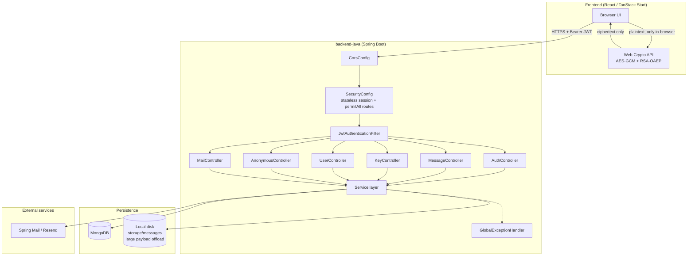

**Key design decisions**

- **Zero-knowledge server**: the API only stores/forwards ciphertext (`encryptedData`, `encryptedAESKey`, `iv`, `salt`). Plaintext and private keys never leave the browser.
- **Stateless security**: `SecurityConfig` sets `SessionCreationPolicy.STATELESS`, disables CSRF (pure JSON API), and routes every request through `JwtAuthenticationFilter` before the standard `UsernamePasswordAuthenticationFilter`.
- **Explicit public-route allow-list**: only OTP/login/signup/password-reset, anonymous send, public message GET/view, and the root mail endpoint are `permitAll()` — everything else requires a valid bearer token.
- **Layered exception handling**: domain logic throws `ApiException(message, HttpStatus)`; `GlobalExceptionHandler` converts these (and framework exceptions like `MaxUploadSizeExceededException`, `BadCredentialsException`, `AccessDeniedException`, `MethodArgumentNotValidException`) into the same `ApiResponse` envelope the Node backend returns, so the frontend doesn't need to know which backend it's talking to.
- **Large payload offload**: message payloads over `MAX_INLINE_MESSAGE_BYTES` (default 12 MB) are written to `storage/messages` on disk via `PayloadStorageService`, mirroring the Node implementation.

---

### 4. Data Model (MongoDB Documents)

Collections and fields are identical to `backend-node` — both backends read/write the same MongoDB database, so documents created by one are fully readable by the other.

#### `User`
| Field | Type | Notes |
|---|---|---|
| `id` | String (ObjectId) | |
| `email` | String | unique, lowercase |
| `passwordHash` | String | BCrypt, 12 rounds |
| `publicKey` | String \| null | |

#### `Otp`
| Field | Type | Notes |
|---|---|---|
| `email` | String | |
| `otp` | String | 6-digit code |
| `createdAt` | Date | 10-minute expiry (checked in `AuthService`) |

#### `Alias`
| Field | Type | Notes |
|---|---|---|
| `alias` | String | unique, `name123@securesend.co.in` |
| `realEmail` | String | owner's real email |
| `isActive` | Boolean | |
| `expiresAt` | Date | 24h lifetime |
| `createdAt` | Date | |

Aliases are generated from a curated word list (`AliasService.COMPANY_NAMES`) + a random 3-digit suffix, retried up to 5 times on collision.

#### `Message`
| Field | Type | Notes |
|---|---|---|
| `encryptedData` | String | AES-GCM ciphertext (base64) |
| `encryptedAESKey` | String | RSA-wrapped AES key (base64) |
| `iv` | String | AES-GCM IV (base64) |
| `salt`, `keyIv` | String \| null | symmetric/password mode metadata |
| `encryptionMode` | Enum | `HYBRID` \| `SYMMETRIC` |
| `kdf`, `kdfIterations`, `aesAlgorithm`, `rsaAlgorithm` | — | crypto metadata |
| `senderId` / `receiverId` | String → `User.id` | |
| `type` | Enum | `text` \| `image` \| `voice` \| `file` |
| `protection` | Enum | `quick` \| `password` \| `key` \| `hybrid` |
| `password` | String \| null | |
| `fileUrl` | String \| null | pointer to offloaded payload |
| `isAnonymous`, `viewOnce` | Boolean | |
| `expiresAt` | Date \| null | |
| `views` | Number | |
| `logs[]` | embedded array | `{ viewedAt, ip, device, userId }` |

#### `Key`
| Field | Type | Notes |
|---|---|---|
| `userId` | String → `User.id` | unique — one primary key per user |
| `publicKey` | String | |

#### `Log`
| Field | Type | Notes |
|---|---|---|
| `messageId` | String → `Message.id` | |
| `userId` | String \| null | |
| `event` | Enum | `created` \| `viewed` \| `decrypted` \| `deleted` \| `failed_attempt` |
| `ipAddress`, `device` | String | |
| `status` | Enum | `success` \| `failed` |
| `details` | String \| null | |

#### `AnonymousMessage`
| Field | Type | Notes |
|---|---|---|
| `to` | String | recipient email or alias |
| `subject`, `message` | String | |
| `senderAlias` | String | |
| `unread` | Boolean | |

#### Entity Relationships


---

### 5. API Reference

Identical contract to `backend-node` — same paths, same JSON envelope, same status codes. Full endpoint documentation lives in the top-level [`README.md`](#-api-reference-full-endpoint-details).

| Resource | Base Path | Auth | Controller |
|---|---|---|---|
| Auth | `/api/auth` | Mixed | `AuthController` |
| Messages | `/api/messages` | Mixed | `MessageController` |
| Keys | `/api/keys` | Required | `KeyController` |
| Users | `/api/users` | Required | `UserController` |
| Anonymous | `/api/anonymous` | Mixed | `AnonymousController` |
| Mail | `/send-email`, `/api/send-email` | Required | `MailController` |

#### Publicly accessible routes (from `SecurityConfig`)

| Method | Path |
|---|---|
| POST | `/api/auth/request-otp` |
| POST | `/api/auth/verify-otp` |
| POST | `/api/auth/signup` |
| POST | `/api/auth/login` |
| POST | `/api/auth/forgot-password` |
| POST | `/api/auth/reset-password` |
| POST | `/api/anonymous/send` |
| GET | `/api/messages/{id}` |
| POST | `/api/messages/{id}/view` |
| POST/GET | `/send-email`, `/api/send-email` |

All other endpoints require `Authorization: Bearer <jwt>` and are rejected with `401` otherwise.

#### Standard response envelope (`ApiResponse<T>`)

```json
// success
{ "success": true, "data": { }, "message": "optional" }

// error
{ "success": false, "message": "Description of what went wrong" }
```

---

### 6. Security Configuration

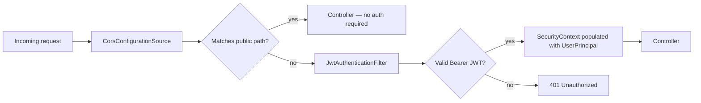

- **Password encoding**: `BCryptPasswordEncoder(12)`.
- **Token signing**: HMAC-SHA256 via `jjwt`, key padded to ≥32 bytes from `securesend.jwt.secret`.
- **Token lifetime**: `securesend.jwt.expiration-ms` = `604800000` (7 days).
- **CSRF**: disabled (stateless JSON API, no cookies used for auth).

---

### 7. End-to-End Flows

#### 7.1 Signup / Login

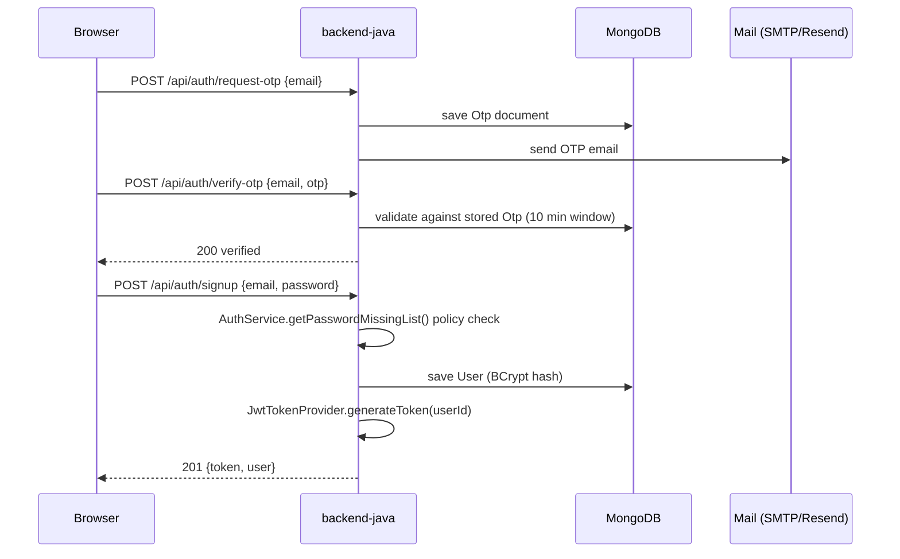

#### 7.2 Sending an End-to-End Encrypted Message (Hybrid)

```mermaid
sequenceDiagram
    participant S as Sender (browser)
    participant API as backend-java
    participant M as MongoDB
    participant R as Recipient (browser)

    S->>API: GET /api/keys/{userId}
    API->>M: KeyRepository.findByUserId
    API-->>S: publicKey (RSA-OAEP)
    S->>S: generate AES-256 key, encrypt message (AES-GCM)
    S->>S: wrap AES key with recipient RSA pubkey
    S->>API: POST /api/messages {encryptedData, encryptedAESKey, iv, ...}
    API->>M: MessageService persists Message document
    API-->>S: 201 {message}
    R->>API: GET /api/messages/inbox (JWT)
    API->>M: query by receiverId; wipe payload fields if expired
    API-->>R: messages[]
    R->>R: unwrap AES key with private RSA key, decrypt locally
    R->>API: POST /api/messages/{id}/view
    API->>M: append Log embed, increment views, wipe payload if viewOnce
```

#### 7.3 Anonymous Email via Disposable Alias

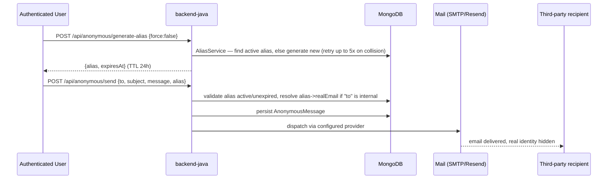

#### 7.4 Error Normalization

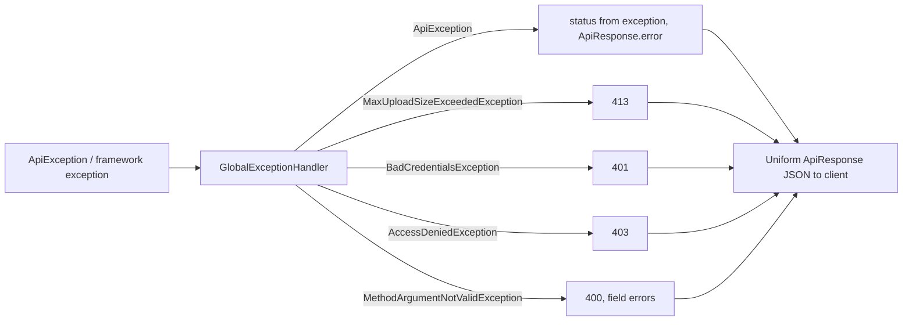

---

### 8. Configuration (`application.yml`)

| Property | Env Var | Default | Description |
|---|---|---|---|
| `server.port` | `PORT` | `5000` | HTTP port |
| `spring.data.mongodb.uri` | `MONGODB_URI` | `mongodb://127.0.0.1:27017/securesend` | Mongo connection |
| `spring.servlet.multipart.max-file-size` | `MAX_FILE_SIZE` | `50MB` | Upload cap |
| `spring.servlet.multipart.max-request-size` | `MAX_REQUEST_SIZE` | `50MB` | Upload cap |
| `spring.mail.host` / `port` / `username` / `password` | `SMTP_HOST` / `SMTP_PORT` / `SMTP_USER` / `SMTP_PASS` | `smtp.gmail.com:587` | SMTP fallback |
| `securesend.jwt.secret` | `JWT_SECRET` | (dev placeholder — **override in prod**) | HS256 signing key |
| `securesend.jwt.expiration-ms` | — | `604800000` (7 days) | Token lifetime |
| `securesend.resend.api-key` | `RESEND_API_KEY` | — | Resend API key |
| `securesend.resend.from` | `RESEND_FROM` | `SecureSend <noreply@securesend.co.in>` | From address |
| `securesend.email.auth-provider` | `AUTH_EMAIL_PROVIDER` | `resend` | Provider used for OTP/auth email |
| `securesend.email.anon-provider` | `ANON_EMAIL_PROVIDER` | `resend` | Provider used for anonymous email |
| `securesend.storage.max-inline-bytes` | `MAX_INLINE_MESSAGE_BYTES` | `12582912` (12 MB) | Offload threshold |
| `securesend.storage.payload-path` | — | `storage/messages` | Disk path for offloaded payloads |

---

### 9. CORS

Configured in `CorsConfig.java` via `setAllowedOriginPatterns`:

- `http://localhost:*`, `http://127.0.0.1:*` (any port, local dev)
- `https://*.onrender.com`, `https://*.vercel.app`, `https://*.pages.dev`, `https://*.workers.dev` (preview/production deploys)
- `https://securesend.co.in`, `https://www.securesend.co.in`, `https://message.securesend.co.in`, `https://www.message.securesend.co.in`

Allowed methods: `GET, POST, PUT, PATCH, DELETE, OPTIONS`. Allowed headers: `Authorization, Cache-Control, Content-Type, X-Requested-With`. Credentials allowed, `maxAge` 3600s.

---

### 10. Running Locally

**Requirements**: JDK 21, Maven 3.9+, a running MongoDB instance.

```bash
cd backend-java

# set env vars (or edit application.yml directly)
export MONGODB_URI=mongodb://127.0.0.1:27017/securesend
export JWT_SECRET=change_me_to_a_long_random_secret
export RESEND_API_KEY=...        # optional, only needed for real email delivery

./mvnw spring-boot:run
# Windows: mvnw.cmd spring-boot:run
```

Or build a jar directly:

```bash
./mvnw clean package -DskipTests
java -jar target/securesend-backend-1.0.0.jar
```

#### Docker

```bash
docker build -t securesend-backend-java .
docker run -p 5000:5000 \
  -e MONGODB_URI=mongodb://host.docker.internal:27017/securesend \
  -e JWT_SECRET=change_me \
  securesend-backend-java
```

The `Dockerfile` is a two-stage build: `maven:3.9-eclipse-temurin-21-alpine` compiles the jar, then `eclipse-temurin:21-jre-alpine` runs it, exposing port `5000`.

---

### 11. Interop Notes (vs. `backend-node`)

| Aspect | backend-node | backend-java |
|---|---|---|
| Response envelope | `{ success, data, message }` | Same, via `ApiResponse<T>` |
| Password hashing | bcryptjs, 12 rounds | Spring `BCryptPasswordEncoder(12)` |
| JWT algorithm | HS256 | HS256 |
| MongoDB collections | Mongoose models | Spring Data `@Document`s, same field names/case |
| Rate limiting | `express-rate-limit` middleware, per-route named limiters | Not yet ported — mirror manually if switching production traffic to Java under load |
| Large payload offload | `utils/payloadStorage.js` → `storage/messages` | `PayloadStorageService` → same relative path |

Because both backends share the same MongoDB schema, you can point the frontend at either one (see `frontend/src/lib/api.ts` — defaults to the Java backend in production, `http://localhost:5000/api` in dev) without a data migration.


---

# Part 4 — Frontend

## SecureSend — Frontend

React 19 single-page app for SecureSend, built with **TanStack Start / TanStack Router**, **Vite 7**, **Tailwind CSS 4**, and **shadcn/ui** (Radix primitives). All encryption/decryption happens client-side using the browser's **Web Crypto API** — the backend (either `backend-node` or `backend-java`) never receives plaintext.

---

### 1. Tech Stack

| Concern | Library |
|---|---|
| UI framework | React 19 |
| Routing / app shell | `@tanstack/react-router`, `@tanstack/react-start` (file-based routes) |
| Data fetching | `axios` (thin client in `src/lib/api.ts`); `@tanstack/react-query` available |
| Styling | Tailwind CSS 4, `tailwind-merge`, `class-variance-authority` |
| Component kit | shadcn/ui (Radix UI primitives) — `src/components/ui/*` |
| Forms | `react-hook-form` + `zod` + `@hookform/resolvers` |
| Animation | `framer-motion` |
| Icons | `lucide-react` |
| Toasts | `sonner` |
| Cryptography | Native Web Crypto API (`crypto.subtle`) — no external crypto library |
| Build tool | Vite 7, `@vitejs/plugin-react`, `vite-tsconfig-paths` |
| Deployment target | Cloudflare Workers (`@cloudflare/vite-plugin`, `wrangler.jsonc`) |
| Lint / format | ESLint 9 (flat config) + Prettier |

---

### 2. Project Structure

```
frontend/
├── src/
│   ├── routes/                      # File-based routes (TanStack Router)
│   │   ├── __root.tsx               # Root layout, 404 page, global <head>
│   │   ├── landing.tsx              # Marketing/landing page
│   │   ├── login.tsx                # Login + OTP-based password reset
│   │   ├── signup.tsx                # Signup with OTP email verification
│   │   ├── index.tsx                 # "/" — main authenticated app shell
│   │   ├── anonymous.tsx             # Disposable alias inbox/compose
│   │   └── m.$messageId.tsx          # Public shared-message viewer ("/m/:messageId")
│   ├── routeTree.gen.ts             # Auto-generated by the TanStack Router plugin
│   ├── router.tsx                   # createRouter() + global error boundary
│   ├── components/
│   │   ├── ui/                      # shadcn/ui primitives (button, dialog, table, ...)
│   │   └── securesend/              # App-specific components (see §5)
│   ├── lib/
│   │   ├── api.ts                   # axios instance, base URL resolution, JWT interceptor
│   │   └── utils.ts                 # `cn()` classname helper
│   ├── hooks/
│   │   └── use-mobile.tsx
│   └── styles.css                   # Tailwind entry + design tokens
├── public/                          # favicons, manifest, sitemap, robots.txt
├── vite.config.ts
├── wrangler.jsonc                   # Cloudflare Workers deployment config
├── components.json                  # shadcn/ui config
└── package.json
```

---

### 3. Architecture

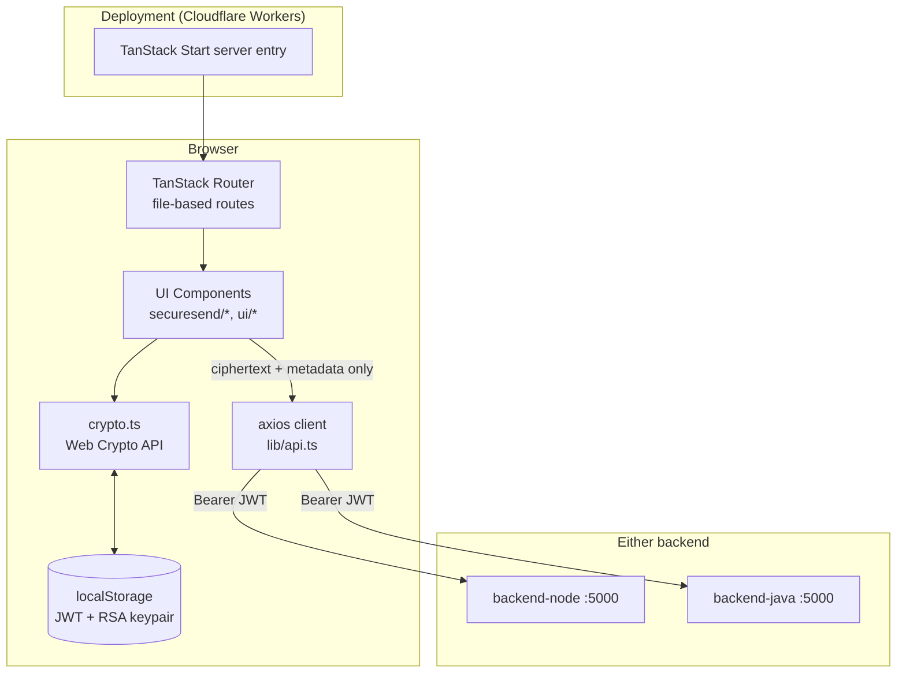

**Key design decisions**

- **File-based routing**: every file in `src/routes/` becomes a route; `routeTree.gen.ts` is generated by the TanStack Router Vite plugin — don't hand-edit it.
- **Client-side auth guard**: routes like `login`, `signup`, `anonymous`, and `index` use `beforeLoad` to check `localStorage.getItem("isLoggedIn")` and `redirect()` accordingly (see §6).
- **Backend-agnostic API client**: `src/lib/api.ts` resolves its base URL from `VITE_API_URL` / `VITE_API_BASE_URL` / `VITE_BACKEND_URL`, falling back to `http://localhost:5000/api` in dev and the Java backend's Render URL in production. Switching backends requires no frontend code changes.
- **Zero-trust encryption**: all AES/RSA key generation, wrapping, encryption, and decryption happens in `crypto.ts` inside the browser using `crypto.subtle`. Private keys are generated with the browser's Web Crypto API and persisted only in `localStorage` on the user's device — never transmitted.
- **Public share links**: `/m/$messageId` is a route that works without authentication so a message link can be shared with someone who doesn't have (or doesn't need) an account — decryption still happens locally using a password/key the recipient supplies out-of-band.

---

### 4. Environment Variables

| Variable | Purpose | Dev default | Prod default |
|---|---|---|---|
| `VITE_API_URL` / `VITE_API_BASE_URL` / `VITE_BACKEND_URL` | Backend base URL (first one set wins) | `http://localhost:5000/api` | `https://clarity-connect-1.onrender.com/api` |

Set one of these in a `.env` (or `.env.local`) file at the frontend root, or via your deployment platform's environment settings, to point at `backend-node` or `backend-java` explicitly.

---

### 5. Feature Components (`src/components/securesend/`)

| Component | Responsibility |
|---|---|
| `Sidebar.tsx` | Folder navigation (Inbox / Sent / Expired / Access Logs), compose button, logout (clears JWT + RSA keys) |
| `ComposeModal.tsx` | Message composer — text/voice/file, protection mode (quick/password/key/hybrid), expiry, view-once, drives the encrypt-then-send flow |
| `MessageList.tsx` | List view per folder |
| `MessageDetail.tsx` | Decrypts and renders a selected message |
| `SharePanel.tsx` | Generates/copies the public share link for a message |
| `AccessLogs.tsx` | Renders per-message view logs (IP, device, timestamp) |
| `CircularTimer.tsx` | Countdown UI for expiring/view-once messages |
| `VoicePlayer.tsx` | Playback UI for decrypted voice messages |
| `HybridSteps.tsx` | Visual step-by-step of the hybrid encryption process (educational UI) |
| `TemplateLibrary.tsx` / `templates.ts` | Prewritten templates for anonymous emails |
| `EmailPreview.tsx` | Preview pane for anonymous email compose |
| `UserSearch.tsx` | Recipient lookup against `GET /api/users/search` |
| `crypto.ts` | Core cryptography module (see §7) |
| `mockData.ts` | Local sample data for offline/demo UI states |
| `utils.ts` | Formatting helpers (e.g. `timeAgo`) |
| `types.ts` | Shared TypeScript types (`SecureMessage`, `EncryptedPayload`, `Folder`, `ProtectionMode`, `AccessLog`) |

#### Core domain types

| Type | Values / Shape |
|---|---|
| `MessageType` | `"text" \| "voice" \| "file"` |
| `Folder` | `"inbox" \| "sent" \| "expired" \| "logs"` |
| `ProtectionMode` | `"quick" \| "password" \| "key" \| "hybrid"` |
| `EncryptedPayload` | `{ encryptedData, encryptedAESKey, iv, salt?, keyIv?, encryptionMode?, kdf?, kdfIterations?, aesAlgorithm?, rsaAlgorithm?, mode?, receiver? }` |
| `AccessLog` | `{ viewedAt, ip, device, viewer? }` |

---

### 6. Routes

| Route | File | Auth Guard | Purpose |
|---|---|---|---|
| `/landing` | `landing.tsx` | redirects away if already logged in | Marketing page, feature highlights, CTA to signup/login |
| `/login` | `login.tsx` | redirects to `/` if already logged in | Email + password login, forgot-password OTP flow |
| `/signup` | `signup.tsx` | redirects to `/` if already logged in | OTP-verified signup, password policy enforcement |
| `/` | `index.tsx` | requires `isLoggedIn` | Main app shell — Sidebar + MessageList + MessageDetail + ComposeModal |
| `/anonymous` | `anonymous.tsx` | requires `isLoggedIn` | Disposable alias generation, anonymous inbox, anonymous compose |
| `/m/$messageId` | `m.$messageId.tsx` | none (public) | Standalone shared-message viewer for a single message link |
| `*` (unmatched) | `__root.tsx` | — | 404 page |

Auth state is derived from two `localStorage` keys: `isLoggedIn` (`"true"`/absent) and `token` (JWT, attached to every request by the axios interceptor in `lib/api.ts`).

---

### 7. Cryptography (`src/components/securesend/crypto.ts`)

All done with `crypto.subtle`, entirely in-browser:

| Primitive | Algorithm |
|---|---|
| Symmetric message encryption | AES-GCM, 256-bit key, 12-byte random IV |
| Key wrapping (hybrid mode) | RSA-OAEP, 2048-bit, SHA-256 |
| Password/key-derivation mode | PBKDF2 → derives an AES key from a shared secret + salt |

| Function | Purpose |
|---|---|
| `generateAESKey()` | Fresh, extractable AES-GCM 256 key |
| `encryptMessage()` / `decryptMessage()` | AES-GCM encrypt/decrypt a string |
| `encryptAESKey()` / `decryptAESKey()` | Wrap/unwrap the AES key with an RSA-OAEP public/private key |
| `hybridEncrypt()` / `hybridDecrypt()` | Full hybrid flow: generate AES key → encrypt payload → wrap AES key with recipient's RSA public key |
| `loadOrCreateRSAKeyPair()` | Persists a per-user RSA keypair in `localStorage` (generated once per browser) |
| `importPublicKey()` | Imports a base64 RSA public key fetched from the backend (`GET /api/keys/:userId`) |
| `clearStoredRSAKeys()` | Wipes local keypair on logout |

**Nothing here ever calls the backend with plaintext.** The backend only ever receives/returns `encryptedData`, `encryptedAESKey`, `iv`, and metadata (`salt`, `kdf`, algorithm identifiers).

---

### 8. End-to-End Flows

#### 8.1 Signup

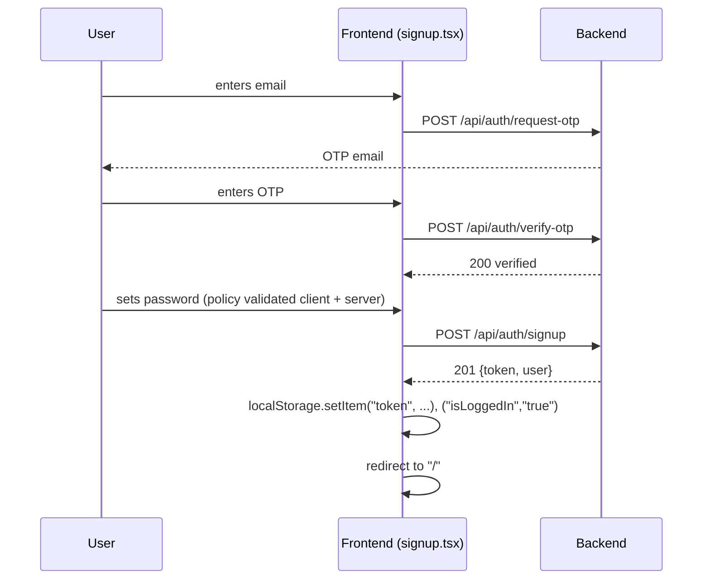

#### 8.2 Composing and Sending a Hybrid-Encrypted Message

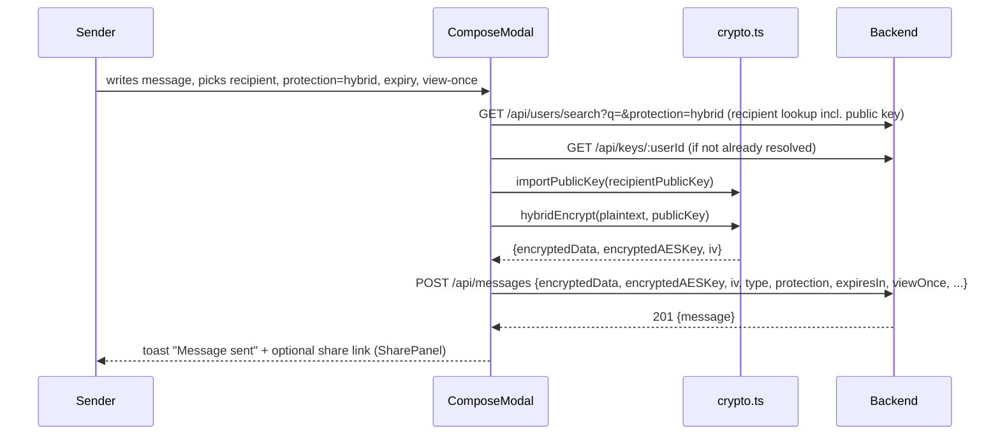

#### 8.3 Reading and Decrypting a Message

```mermaid
sequenceDiagram
    participant U as Recipient
    participant FE as MessageList / MessageDetail
    participant CR as crypto.ts
    participant API as Backend

    U->>FE: opens Inbox
    FE->>API: GET /api/messages/inbox (JWT)
    API-->>FE: messages[] (still ciphertext)
    U->>FE: selects a message
    FE->>CR: decryptAESKey(encryptedAESKey, ownPrivateKey)
    CR->>CR: decryptMessage(encryptedData, aesKey, iv)
    CR-->>FE: plaintext
    FE->>API: POST /api/messages/:id/view (logs view; wipes payload server-side if viewOnce)
    FE-->>U: renders decrypted content (text/voice/file)
```

#### 8.4 Anonymous Email

```mermaid
sequenceDiagram
    participant U as User
    participant FE as anonymous.tsx
    participant API as Backend
    participant T as Third-party recipient

    U->>FE: clicks "Generate alias"
    FE->>API: POST /api/anonymous/generate-alias
    API-->>FE: {alias, expiresAt} (24h TTL)
    U->>FE: composes email (TemplateLibrary / EmailPreview)
    FE->>API: POST /api/anonymous/send {to, subject, message, alias}
    API-->>T: email delivered from alias, real identity hidden
    FE->>API: GET /api/anonymous/inbox
    API-->>FE: thread of sent/received anonymous messages
```

#### 8.5 Public Shared Link

```mermaid
sequenceDiagram
    participant V as Anyone with the link
    participant FE as m.$messageId.tsx
    participant API as Backend

    V->>FE: opens /m/:messageId
    FE->>API: GET /api/messages/:id (public)
    API-->>FE: ciphertext + metadata (no password field)
    FE->>V: prompts for password/key if protection requires it
    FE->>FE: decrypts locally via crypto.ts
    FE->>API: POST /api/messages/:id/view
    FE-->>V: renders plaintext (once, if viewOnce)
```

---

### 9. Running Locally

```bash
cd frontend
npm install   # or bun install — bunfig.toml is present

# point at a running backend (Node on :5000 by default in dev)
npm run dev
```

Vite dev server starts (default `http://localhost:5173`). Make sure `backend-node` or `backend-java` is running on port `5000`, or set `VITE_API_URL` to a different backend URL.

#### Build & Preview

```bash
npm run build      # production build (Cloudflare-targeted, via @tanstack/react-start + @cloudflare/vite-plugin)
npm run preview    # preview the production build locally
```

#### Lint / Format

```bash
npm run lint
npm run format
```

#### Deployment

The app is configured for **Cloudflare Workers** (`wrangler.jsonc`, entry `@tanstack/react-start/server-entry`), and CORS on both backends already allow `*.pages.dev` / `*.workers.dev` preview subdomains as well as `*.vercel.app` — so it can also be deployed to Vercel without config changes. Set the appropriate `VITE_API_URL` for whichever backend deployment (Node or Java) the frontend should call.

---

### 10. Design System

Built on **shadcn/ui** (`components.json` configures the CLI) with Tailwind CSS 4 design tokens defined in `src/styles.css`. All Radix-based primitives live under `src/components/ui/` (accordion, dialog, dropdown-menu, sidebar, table, tabs, toast/sonner, etc.) and are composed into the SecureSend-specific components under `src/components/securesend/`.
